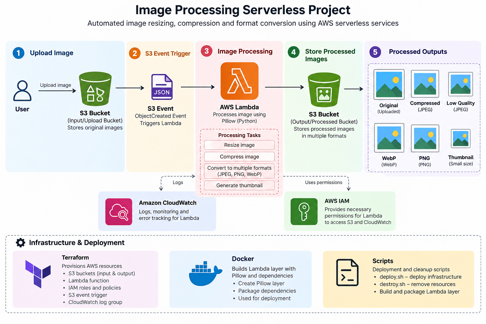

```markdown
# 🖼️ Serverless Image Processing on AWS

A serverless, event-driven image processing system built with **AWS Lambda, Amazon S3, Terraform, Docker, and Python**.

Images uploaded to an S3 bucket automatically trigger a Lambda function that processes the image and stores multiple optimized versions in a separate S3 bucket.

---

## 🏗️ Architecture



### Workflow

```text
User
 │
 │ Upload Image
 ▼
Amazon S3
 │
 │ ObjectCreated Event
 ▼
AWS Lambda
 │
 ├── Resize
 ├── JPEG Compression
 ├── WebP Conversion
 ├── PNG Conversion
 └── Thumbnail
 │
 ▼
Processed S3 Bucket
```

---

## ☁️ AWS Services

| Service | Purpose |
|---|---|
| **Amazon S3** | Stores original and processed images |
| **AWS Lambda** | Processes images automatically |
| **IAM** | Controls Lambda permissions |
| **CloudWatch** | Lambda execution logs |
| **Terraform** | Infrastructure as Code |

### Supporting Tools

- **Python + Pillow** — Image processing
- **Docker** — Builds Lambda-compatible Pillow dependencies
- **AWS CLI** — Deployment and testing
- **Bash** — Deployment automation

---

## ⚙️ How It Works

1. User uploads an image to the **S3 upload bucket**.
2. S3 generates an `ObjectCreated` event.
3. The event triggers **AWS Lambda**.
4. Lambda downloads and processes the image using **Pillow**.
5. Multiple optimized versions are generated.
6. Results are uploaded to the **processed S3 bucket**.
7. Execution details are recorded in **CloudWatch**.

### Generated Versions

```text
original_compressed.jpg
original_low.jpg
original_webp.webp
original_png.png
original_thumbnail.jpg
```

---

## 🔐 Security

- S3 public access blocked
- S3 server-side encryption enabled
- S3 versioning enabled
- IAM permissions scoped to required operations
- Lambda uses a dedicated execution role

---

## 🏗️ Infrastructure as Code

The AWS infrastructure is managed using Terraform.

```bash
cd terraform

terraform init
terraform plan
terraform apply
```

Docker is used to build the Pillow Lambda layer:

```bash
./scripts/build_layer_docker.sh
```

Deployment:

```bash
./scripts/deploy.sh
```

Cleanup:

```bash
./scripts/destroy.sh
```

---

## 📁 Project Structure

```text
Image-Processing-Serverless-Project/
│
├── lambda/
│   ├── lambda_function.py
│   └── requirements.txt
│
├── terraform/
│   ├── main.tf
│   ├── provider.tf
│   ├── variables.tf
│   └── outputs.tf
│
├── scripts/
│   ├── build_layer_docker.sh
│   ├── deploy.sh
│   └── destroy.sh
│
└── docs/
    └── architecture.png
```

---

## 💡 What I Learned

- Event-driven AWS architecture
- AWS Lambda and S3 integration
- IAM and secure permissions
- Terraform Infrastructure as Code
- Docker-based Lambda dependency packaging
- Python image processing with Pillow
- CloudWatch logging
- AWS CLI and Bash automation

---

## 🚀 Future Improvements

- API Gateway + presigned uploads
- SQS + Dead Letter Queue
- CloudWatch alarms and SNS notifications
- GitHub Actions CI/CD
- DynamoDB metadata storage
- Step Functions for multi-stage processing

---

## 👩‍💻 Author

**Anjali Prasad**

